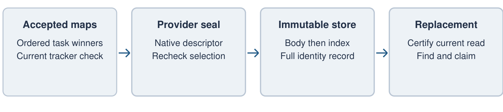
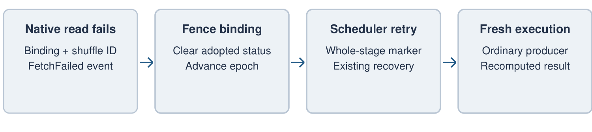

# Design Contracts: Completed-Shuffle Reuse

Unik Dahal | Companion to the SPIP discussion draft

The main proposal defines the extension boundaries. Sections 1–8 explain their design;
sections 9–13 specify identity scope, admission, transitions, limits and conformance.
“Must” denotes a requirement for the proposed upstream feature. Private signatures are
concrete interface sketches; they do not establish a public compatibility promise.

## 1. Establishing that a read is the same

A replacement query must resolve its source normally before looking for reusable shuffle output. Otherwise discovery could change the meaning of the query by directing it to a snapshot that the new application did not request.

The source adapter certifies the read Spark has actually planned. That certificate needs to cover the source version, delete semantics, options and row interpretation that affect the returned data. Spark then adds the meaning of the producer's filters, projections and partitioning.

The proposed source boundary follows this shape:

```scala
def bind(
    plan: BatchScanExec,
    protocolId: String,
    protocolVersion: Int,
    certificate: Array[Byte],
    certifiedPartitions: Vector[(InputPartition, Array[Byte])])
    : Either[ShuffleRecoveryMissReason, ShuffleRecoverySourceBinding]
```

The partition objects in this call are the same objects, in the same order, that the scan will execute. The adapter must not call a second planning operation and assume it obtained an equivalent answer. The binding owns copies of the certificate bytes and can later check that the scan and partition sequence are still current.

There are two reasons a replacement read might differ: the data's meaning has changed, or the same data has been divided into different physical splits. The first implementation requires both to match. This may reject harmless replanning, but makes mapper correspondence explicit. A future relaxation would need a separate argument for why the changed layout preserves every relevant shuffle property.

### Planning changes after certification

Runtime filtering and grouped partitions complicate the relationship between a source certificate and the rows eventually read. The initial path should reject active runtime filters and grouped scan partitions, and refuse a binding whose planned sequence changes. Supporting a connector interface is not enough; the adapter must account for the actual planning lifecycle.

An unavailable certificate means Spark cannot use this optimization. A normal source planning or authorization error remains a query error. These outcomes should not be conflated: falling back to computation cannot make an unreadable source valid.

The connector is trusted to describe its read correctly. A digest protects comparison and lookup; it cannot establish the truth of a source's certificate.

<!-- pagebreak -->

## 2. Describing the computation

The identity should describe the computation rather than the incidental IDs assigned during planning. Expression IDs, local shuffle IDs and object addresses can change after a restart without changing the query. They are useful for local checks, but should not become cross-driver identity fields.

Spark should use a versioned encoding for a small set of reviewed producer operators and expressions. Unsupported nodes decline reuse. Transparent execution wrappers may be ignored only where they do not change the encoded semantics.

| Part of the identity | What it establishes |
| --- | --- |
| Source facts | The resolved read, including source-specific row and delete semantics. |
| Producer | Supported expressions, literals, types and operations that determine the rows. |
| Mapper decomposition | The ordered source partitions assigned to producer tasks. |
| Output partitioning | Partitioning expressions, reducer count and relevant partitioner behavior. |
| Compatibility | Spark build, serializer and provider read format, plus modeled semantic settings. |

ANSI behavior, timezone and compression settings are examples of dependencies that need explicit treatment. An operator with additional dependencies cannot be admitted merely because some settings are already represented. Connector and provider protocol versions must also have a clear compatibility meaning.

### Exact comparison and bounded metadata

A digest provides a practical discovery key. It should not be the only comparison: the retained record carries the canonical payload so Spark can compare the complete encoded identity before adoption.

The encoding needs limits on depth, node count, string length, certificate size and partition metadata. Lengths must be checked before allocation when decoding records. A source with too many splits should cause an ordinary miss rather than unbounded driver metadata.

Ordered split descriptors preserve ordering and duplicates. A connector may use a framed digest for a large source-specific decomposition, but the generic contract still has to state what each mapper represents. A compact digest is not a reason to stop reviewing those semantics.

### Identity is not authority

Two applications can have identical computation identities and different access rights. A record match does not authorize either discovery or reading. It also does not establish that the applications belong to one logical retry. Those decisions belong to the deployment's access policy, independently of SQL equivalence.

<!-- pagebreak -->

## 3. Publishing completed output

A retained artifact must refer to the map attempts Spark accepted. Speculation makes the logical map number insufficient: two attempts can write output for the same map, while only one is selected for the stage.

The provider-facing publication contract can remain small:

```scala
trait ShuffleRecoveryNativePublicationProvider {
  def compatibilityId: String
  def seal(
      shuffleId: Int,
      acceptedAttempts: Vector[ShuffleRecoveryMapAttempt]): Vector[Byte]
}
```

The accepted-attempt vector is ordered by map index and includes task and stage-attempt coordinates. The provider translates these into its own native representation. It must not interpret the call as permission to choose whichever output it happens to find for each map.



Spark checks that the full winner selection agrees with current tracker state before sealing. It checks again after sealing and captures the scheduling metadata for that same selection. Only then is the manifest published. A changed selection or incomplete output prevents publication.

The descriptor returned by `seal` is opaque to SQL. The configured provider validates its format and uses it to locate native data. The manifest cannot select an arbitrary implementation class or redefine the computation identity.

### Making a record discoverable

Publication writes an immutable manifest body before committing its discovery reference. A reference must never expose a partially written body as a complete candidate. Repeating publication of the same record should be idempotent; a conflicting record must not overwrite an existing incarnation.

The manifest includes the recovery group, publishing generation and incarnation, canonical identity, shape, descriptor and accepted-map scheduling metadata. Native descriptors and dense mapper/reducer metadata require separate size limits.

Checks around sealing protect the publication operation. They do not solve every later invalidation. If Spark or the provider subsequently learns that an artifact is semantically invalid, future reuse must be prevented. The provider lifecycle needs an explicit treatment of that case; expiry alone is not an answer once the artifact is known to be bad.

<!-- pagebreak -->

## 4. Discovery and preparation

The manifest store provides two operations: publish an immutable record, and find an earlier compatible record within a recovery group. Lookup compares the canonical identity and provider format, checks the record's generation and incarnation, and rejects malformed references. An overfull discovery namespace should fail closed rather than turn one lookup into an unbounded scan.

Keeping the manifest store separate from the provider allows Spark to own the record format without imposing a storage service on every shuffle implementation. It does mean the deployment must protect two resources: discovery metadata and retained bytes. Their access policies must agree.

### Preparing a reader

A candidate record is only a starting point. The configured provider must validate its descriptor and prepare a current read claim before Spark can suppress producer work. The claim must refer to the complete materialization, remain independent of other readers and have a defined expiry and release behavior.

Preparation runs outside scheduler serialization. It associates the candidate with a reservation for the current materialization and exact local dependency. The result is either a prepared installation or a reason to compute normally. A reservation should not permit an offer from an older attempt to replace a newer decision.

The local installation has this contract:

```scala
trait ShuffleRecoveryNativeInstallation extends AutoCloseable {
  def compatibilityId: String
  def descriptor: Vector[Byte]
  def location: BlockManagerId
  def isCurrent: Boolean
  def install(): Boolean
  def invalidate(): Unit
}
```

`isCurrent`, `install` and `invalidate` must be local operations. `close` may contact the provider and is scheduled outside the scheduler's critical path. Ownership transfers with the offer, including offers that are rejected, so there is one clear party responsible for releasing the claim.

### What happens on a miss?

No matching record, an expired claim or an incompatible descriptor should leave the dependency available for ordinary execution. Source errors retain their normal behavior. Preparation needs a finite budget and cancellation handling so an unresponsive provider cannot hold a query indefinitely.

There is a latency tradeoff here: waiting longer can increase the chance of reuse, but delays every miss. This should be measured and exposed as a bounded policy, rather than described as free because the work happens on another thread.

<!-- pagebreak -->

## 5. The scheduler's adoption decision

Adoption occurs before Spark selects missing producer partitions. The scheduler verifies the current reservation, the exact dependency, the expected mapper count and the absence of accepted ordinary map output. It also verifies that the prepared binding is still current.

If those checks succeed, Spark installs the native reader binding in the current shuffle handle and replaces the dependency's empty tracker status with the complete retained status. The tracker epoch advances so executors do not continue using stale cached metadata. If the installation does not commit, ordinary execution wins and the prepared claim is released.

This must be one local decision. A provider callback cannot independently declare the map stage complete while Spark is submitting fresh maps for the same dependency.

### Availability and the data path

The tracker needs enough information to establish map availability and support scheduling. It does not need to turn native retained storage into local Spark index files. Accepted map IDs and reducer-size estimates can be represented in native map statuses, while the configured shuffle implementation reads through its own handle and descriptor.

The binding's synthetic location identifies this installation for failure handling. Ordinary readers must not interpret it as a physical executor address from which they can fetch conventional blocks.

### Dependency sharing

Tracker-backed availability belongs to a dependency, not a single SQL action. That is important when considering exchange reuse or multiple consumers. Admitting one consumer cannot silently establish that every other consumer is safe to use the retained output.

The first upstream integration should therefore select a dependency whose consumer path is understood and reject shared exchange shapes until their ownership and recovery behavior are reviewed. A separate action-scoped availability system is another possible design, but should be justified by the sharing requirements rather than assumed necessary at the outset.

### Cleanup

Cancellation, rejected offers and shuffle unregistration must fence the binding locally and arrange provider cleanup. A slow or failing release cannot restore an invalid binding. Cleanup queues and per-driver retained state need bounds, just as discovery and encoding do.

The proposed scheduler hooks cover adoption before missing-map selection, classification of an adopted fetch failure, a whole-stage retry requirement and adoption status. Their purpose is to keep provider I/O out of Core's serialized decisions while still letting Core own the outcome.

<!-- pagebreak -->

## 6. Adaptive query execution

AQE can change an exchange before creating and materializing its shuffle query stage. A claim prepared for the initial plan may therefore belong to a different dependency from the one that actually executes.

Preparation needs to follow the exchange through those transformations and run against the final exchange, immediately before map-stage submission. The source certificate remains tied to the read already planned; the producer identity is checked again for the materialized exchange.

```scala
ShuffleRecoveryExchangePreparation.attach(initialExchange) { exchange =>
  // Validate the current source binding and producer identity.
  // Prepare adoption for this exchange's actual dependency.
}
```

After the scheduler decides between adoption and ordinary maps, the existing map-stage completion path supplies statistics to the query stage. AQE can then choose its reducer reads. This avoids treating the initial plan's dependency as if it were guaranteed to survive adaptive planning unchanged.

### Reader shapes

The first supported grammar is all maps over one complete reducer or a contiguous range of complete reducers. Coalescing falls within that grammar. Partial mapper ranges, skew splits, local shuffle readers and merged-shuffle representations require additional information and separate review.

Admission must account for the adaptive rules that can affect the selected exchange, and the actual reader specifications must be checked before tasks are launched. Unknown extension rules cannot be assumed to preserve the supported shapes. If a late rewrite falls outside the agreed contract, Spark must fail closed; it must not route an unsupported read into the retained provider.

The exact handling of that late case needs SQL review. In particular, a completed query-stage future cannot simply be reset to pending and treated as if no materialization occurred.

### Statistics

An adopted exchange has no current-attempt shuffle-write metrics. Zero recorded rows therefore does not mean that the exchange is empty. Its SQL row count must remain unknown unless a trustworthy value is available for the retained materialization.

Reducer-size estimates can support the existing scheduling path, but must not be described as exact native byte counts. Broader AQE decisions may require stronger statistics than the initial reader grammar does. Any such requirement belongs in the provider contract with explicit units, shape checks and size limits.

Validation should inspect the final adaptive plan and actual partition specifications. It should also exercise retained-data loss after materialization, because successful coalescing alone says little about recovery.

<!-- pagebreak -->

## 7. Failure after adoption

Retained data can disappear after a successful claim. A lease can expire, a service can restart or a read can discover unavailable data. The reader must report the failure with enough information to identify the exact binding and dependency that were in use.

The proposed native path translates an adopted-read failure into Spark's fetch-failure machinery. The retained location identifies the binding rather than an ordinary failed executor.



For a current binding, the backend first fences the reader, removes adopted availability, invalidates serialized tracker caches and advances the epoch. It records the whole-stage retry requirement and defers provider release. A stale failure must not clear a new binding or fresh output that belongs to a later generation.

DAGScheduler can then apply its stage recovery rules. A retained binding address must not trigger unrelated host-wide cleanup. Recomputing the producer means computing the full exchange from the current source, not filling a few missing blocks while leaving the old binding active.

### Results already in flight

This is the recovery boundary that needs the most careful review. Tasks from the old generation may still be running or completing when the failure arrives. Cancellation does not prove that their completion events have disappeared. Task-attempt and stage-generation checks must prevent stale completions from being accepted as part of fresh execution.

A pure result path is easier to reason about than a write or callback, but purity alone does not establish that Spark can roll back a result already delivered to application code. The first supported consumer must fit the scheduler's actual retry or abort behavior. There is no general promise of exactly-once application effects in this proposal.

### Availability and invalidity

Temporary unavailability and known-invalid data have different lifecycles. A later attempt may be able to read an artifact after a transient outage. An artifact with a known semantic contradiction or corruption must not be rediscovered repeatedly as a valid candidate.

The local scheduler can fence its own binding. Preventing future claims requires cooperation from the manifest/provider lifecycle. That durable behavior, including idempotence and failure during invalidation, must be settled before production enablement.

Fault tests should cover both events and their races: old successes after fencing, duplicate failures, lease renewal replies after expiry, and cancellation during release.

<!-- pagebreak -->

## 8. Access, lifetime and interface review

Source authorization, discovery authorization and permission to read retained bytes are separate checks. The current principal must pass each applicable check. Matching query semantics cannot bridge an access boundary between applications.

A recovery group and publishing generation provide a useful namespace and ordering rule. They do not authenticate retry membership. Deployment integration must establish who may publish into the group, who may discover its records and who may claim its artifacts. If the product requires strict logical-retry confinement, that membership must come from a trusted authority rather than a caller-selected string.

The same principle applies to encryption. Retained readers need authorized cross-attempt access through the provider's security model. Canonical records and serialized task metadata should contain references and public compatibility facts, not the earlier application's bearer secrets.

### Reader lifetime

Each reader needs an independent claim so that one application's cleanup cannot revoke another's access accidentally. Lease expiry must fence local reads even if a delayed renewal reply subsequently arrives. Provider restart needs a defined incarnation policy: either the provider can restore the claim safely, or the replacement computes normally.

Retention, quotas and eventual deletion belong to the provider/operator. Manifest expiry and byte expiry can occur separately; discovery must tolerate that race. Removing a record does not by itself prove that a reader has stopped, and releasing a reader does not necessarily mean the retained artifact should be deleted.

### Interface decisions for upstream review

The contracts in these notes describe required responsibilities. Their current class names need not become public APIs. Source certification should begin as an internal or experimental capability; existing sources must continue to work without it. Provider capability discovery must respect the shuffle implementation selected for the blocking dependency and remain compatible with existing shuffle-extension work.

Useful review questions are whether the source facts are sufficient, whether tracker-backed adoption can be contained to the initial consumers, and whether the manifest/provider split fits real deployments. Answers to those questions should guide API placement and defaults.

### Further reading

[Source and scheduler integration code](https://github.com/unikdahal/spark/tree/ab0052497c019d047fee2bea4b2dba1674ae5db4) is available in the current Spark fork for readers who want to inspect concrete signatures. The proposal's requirements and initial scope are described in the [main document](spip-proposal.md).

Related work: [SPARK-25299](https://issues.apache.org/jira/browse/SPARK-25299), [SPARK-54327](https://issues.apache.org/jira/browse/SPARK-54327) and the [SPIP process](https://spark.apache.org/improvement-proposals.html).

<!-- pagebreak -->

## 9. Data contracts and identity scope

Three identities serve different purposes and must not be interchangeable. Computation identity answers whether work is equivalent. Publication identity selects a retained incarnation. Local binding identity fences the current driver's scheduling decision.

| Field | Lifetime | Meaning and comparison |
| --- | --- | --- |
| Canonical payload and digest | Across attempts | Versioned semantic record; full payload equality is required after digest lookup. |
| Recovery group | Across attempts | Authorized discovery namespace; not a credential or proof of common submission. |
| Publishing generation | Across attempts | Positive ordering value; only earlier generations are considered. Not a consistency or security epoch. |
| Incarnation ID | Artifact lifetime | Immutable publication identity; retrying the same publication cannot change its contents. |
| Local materialization ID | Current driver | Selected exchange and materialization attempt. Never evidence of cross-driver equivalence. |
| Target shuffle/dependency | Current driver | Exact local dependency to which adoption may apply. A reused integer alone is insufficient. |
| Decision version | Current driver | Single-use reservation fence. Cancellation or ordinary execution makes old offers terminal. |
| Binding location and tracker epoch | Installed reader | Identify adopted read failures and invalidate stale metadata for this installation. |

The local reservation carries the following fields:

```scala
case class ShuffleRecoveryAdoptionReservation(
    materializationId: ShuffleRecoveryMaterializationId,
    targetShuffleId: Int,
    dependencyIdentity: Long,
    decisionVersion: Long)
```

The durable record must not contain a live Spark dependency, an application object graph or a current reader's secret. Local references can be used to validate a claim against the executing plan, but cannot enter the cross-driver semantic key.

### Encoding contract

Every variable-length field needs framing and an encoded-length bound. The decoder validates collection sizes before allocation, rejects unknown required versions and rejects inconsistent shape fields. Lookup never loads provider classes from metadata. A provider format is chosen by configuration and compared with the record's declared format.

Canonical equality includes the partitioning method and reducer count, ordered mapper descriptors, admitted producer semantics and compatibility fields. A changed partition order or duplicate count changes identity. Debug strings and Catalyst `toString` output are not an encoding contract.

<!-- pagebreak -->

## 10. Admission contract for the first integration

Admission is required on both publication and replacement paths. Publication cannot make an unsupported producer eligible merely by attaching a source token. Replacement must independently establish all the same facts against its actual planned exchange.

```text
producer := certified batch scan
          | filter(admitted predicate, producer)
          | project(admitted expressions, producer)
boundary := hash or single-partition blocking row shuffle(producer)
reader   := all maps, reducers [start, end)
            where 0 <= start < end <= reducerCount
```

The initial expression set is references, aliases, supported typed literals, equality/null-safe equality, ordered comparisons, boolean conjunction/disjunction/negation and null tests. Each admitted node needs a reviewed type/encoding rule. Determinism is necessary but insufficient: an unknown deterministic expression still declines. Arithmetic with context-dependent behavior, casts, UDFs and custom expressions are not admitted by implication.

Execution wrappers may be removed from identity only when they preserve the encoded row semantics. Source certificates are associated with the same planned batch and partition objects. Runtime filters, grouping or a changed source decomposition invalidate that association.

### Consumer and AQE checks

| Check | Initial decision |
| --- | --- |
| JVM row collection over the selected exchange | Eligible only through the admitted pure row path. |
| Full reducer or coalesced contiguous complete reducers | Eligible; require provider support for the entire interval. |
| Partial mapper, skew split, mapper-local read | Decline. Reducer count alone does not establish read compatibility. |
| Exchange reuse, several actions sharing the dependency | Decline until ownership and recovery are separately designed. |
| Writes, callbacks, iterators, Python/Connect delivery | Decline; the result lifecycle is outside the initial contract. |
| Descendant join, aggregate, exchange or broadcast | Decline until producer/consumer recovery has explicit admission. |
| Unknown AQE extension or late unsupported read spec | Do not open a retained reader. Refuse adoption when knowable early; fail closed if discovered after materialization. |

Source and producer checks run before preparation and again where AQE's final exchange requires revalidation. Reader bounds are checked before task submission and again by the provider reader. The initial integration must either constrain applicable adaptive rewrites to this grammar or decline that exchange. It cannot assume the final reader exists before AQE materializes the stage.

This is the proposed release boundary. It deliberately does not equate an arbitrary query passing a deterministic-expression check with a recoverable action.

<!-- pagebreak -->

## 11. Adoption state and failure contract

The state below belongs to a current local dependency. Provider lookup, sealing, claim acquisition and release are external work; only installation, fencing and tracker updates participate in scheduler serialization.

| State and event | Preconditions | Transition and owner |
| --- | --- | --- |
| Unprepared → reserved | Admitted exchange; current target | Coordinator allocates a single-use decision version. |
| Reserved → ready | Matching manifest; authorized, current complete claim | Provider adapter offers immutable descriptor and local installation. |
| Reserved/ready → ordinary | Timeout, miss, cancellation or ordinary submission wins | Coordinator/scheduler makes reservation terminal; late resources are released. |
| Ready → adopted | Exact dependency; current reservation; empty expected tracker status; live claim | Scheduler installs handle, replaces status, records binding and advances epoch. |
| Adopted → invalidated | Current binding reports failed read, or cancellation/unregistration | Backend fences handle and clears adopted status; caches/epoch change locally. |
| Invalidated → ordinary recovery | Whole-stage retry marker consumed | DAGScheduler applies its retry/rollback or abort decision; fresh maps do not reuse the old binding. |
| Any terminal state + old offer/event | Reservation or binding no longer current | Ignore its state change; release any owned external resources. |

A successful install is visible before missing-map selection. If handle installation succeeds but the expected tracker replacement does not, the handle must be invalidated before returning a failed adoption. A partially installed claim cannot remain readable as if map suppression had committed.

### Error and ownership rules

Source planning exceptions propagate unchanged. Unsupported semantics and unavailable certificates decline reuse. Malformed records, incompatible versions and unavailable claims are misses, with bounded diagnostics. A failure while sealing or publishing does not invalidate otherwise successful ordinary computation.

After adoption, a native availability failure is not a discovery miss: it must identify and fence the installed binding before recovery. Corruption or a known semantic contradiction must also prevent future adoption through the provider/manifest lifecycle; local tracker clearing alone is insufficient.

Success acceptance and failure processing must obey Spark's stage/task attempt rules. Old successes cannot count toward a fresh attempt. When those rules cannot undo or safely complete the admitted consumer, the action aborts. This proposal does not introduce a separate transaction around arbitrary application result handlers.

Cleanup is idempotent. Its failure is recorded but cannot resurrect a fenced binding, block the event loop on provider I/O or transfer ownership back to a caller whose offer was consumed.

<!-- pagebreak -->

## 12. Limits, deployment defaults and conformance

Initial limits should be explicit and conservative. The following values provide a concrete starting point for review; larger limits require scaling evidence rather than an unbounded fallback.

| Resource | Initial bound or policy |
| --- | --- |
| Source partitions / split descriptor | 4,096 partitions; 64 KiB per descriptor |
| Framed source token / canonical identity | 64 KiB token; 1 MiB complete identity |
| Source certificate plus decomposition | 1 MiB combined budget |
| Native descriptor / complete manifest | 5 MiB / 8 MiB |
| Dense map/reducer estimate matrix | 131,072 cells; reject before allocation |
| Enablement | Off unless explicitly enabled for an admitted query and configured provider/store. |
| Lookup, publication and cleanup | Finite deadlines and bounded queues; limits must be part of configuration, not hidden unbounded retries. |
| Retention and authorization | Provider/deployment policy; no implicit permission from a record or group name. |

Configuration must cover enablement, manifest location, recovery scope, publication generation/incarnation, provider format, preparation budget and retention/claim policy. Exact user-facing names should be agreed during API review. Existing applications must not need these settings, and an unsupported capability must not prevent ordinary execution.

<!-- pagebreak -->

## 13. Acceptance tests for the contracts

Each test must exercise the stated boundary in the supported execution path. Component tests alone do not establish the behavior of a distributed query. The following outcomes are release requirements for the admitted scope.

| Test | Required observation |
| --- | --- |
| Exact match; changed source/expression/format/layout | Match suppresses producer maps; each change independently misses. |
| Speculative winners; seal/publication interruption | Only the complete accepted winner set becomes discoverable; no partial record. |
| Map submission versus prepared offer | Exactly one decision wins; the losing claim is released. |
| Full/coalesced AQE reads; unsupported spec | Correct final ranges and results; unsupported retained read never opens. |
| Loss/expiry with late old success and duplicate failure | Binding fenced; old output not accepted into fresh execution; correct retry or abort. |
| Concurrent claims; owner restart; delayed renewal | Independent ownership; obsolete/expired claims cannot revive. |
| Malformed lengths, huge metadata, false credentials | Bounded rejection without allocation explosion or unauthorized read. |

Release review also requires multi-host execution, consumer-specific partial-result tests, access/encryption coverage and measured first-attempt/all-miss overhead.


### What a successful hit must establish

The replacement resolves the source independently, matches the complete canonical identity, installs a current provider claim and launches zero producer map tasks. The result must equal ordinary recomputation. Actual reader specifications and bytes read must establish that the retained provider path was used; a cache hit elsewhere is not evidence of exchange adoption.

### What a successful recovery must establish

The test must place the fault at a known point in the lifecycle: before installation, after installation but before reads, during an open read, or while task completion races failure processing. It must verify the old binding becomes unusable and that fresh work cannot accept old-generation completions. An expected abort is valid only where the admitted consumer's documented recovery rule requires it.

### Disabled and all-miss behavior

With reuse disabled, no discovery or provider claim should occur. With every lookup missing, results and source-error behavior must match ordinary execution. Measure the added delay before map submission, metadata allocation and cleanup load. With publication enabled on the first attempt, measure both successful publication cost and queue saturation behavior.

Run these checks with the intended source, provider and AQE settings. Report exclusions. Every new expression, source feature, limit or consumer shape needs corresponding conformance coverage.
