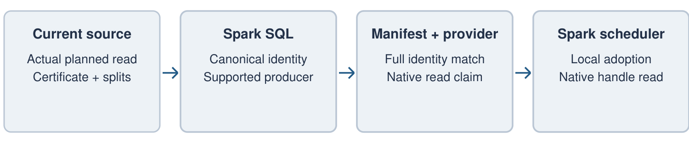

# Reusing Completed Shuffle Output After a Driver Restart

**Spark Project Improvement Proposal — discussion draft**

Unik Dahal

## Q1. What are you trying to do?

A batch application can lose its driver after spending a substantial amount of time producing shuffle output. When the application is submitted again, Spark repeats that work even if a shuffle service still holds the completed output.

I propose allowing Spark to reuse that output when the replacement driver can establish that its new query needs exactly the same computation. The replacement still plans the query and resolves its data sources normally. If the source read, producer expressions, partitioning and data format match a complete retained exchange, Spark can skip the producer map tasks and read the retained output. If they do not match, execution proceeds as usual.

Consider a query that reads an immutable dataset, applies a filter and projection, and repartitions the result. The driver fails after the repartitioning work has finished. The resubmitted query resolves the same read and requests the same exchange. Keeping those bytes can save work, but their existence is only half the problem: Spark must also determine whether using them would preserve the query's meaning.

This proposal adds that determination and connects it to the scheduler's decision to submit map tasks. Storage remains the responsibility of the configured shuffle provider.

### What should change for users?

An operator should be able to enable reuse for eligible batch jobs without rewriting those jobs around durable intermediate tables. Successful reuse should shorten a retry by avoiding completed producer work. Missing data, an unsupported query or a changed source should leave Spark free to recompute.

The feature should be optional. Applications that do not enable it, and connectors that do not support read certification, should continue to behave as they do today.

The rest of this proposal sets out an initial scope, the responsibilities Spark would take on and the questions that need community input. The accompanying [design notes](spip-design-evidence.md) describe the source, provider and scheduler contracts in more detail.

<!-- pagebreak -->

## Q2. What problem is this proposal NOT designed to solve?

This work concerns the output of a completed SQL exchange. It does not restore the driver's memory, resume arbitrary application code, checkpoint streaming state or recover side effects from writes. It also does not let retained data choose which source snapshot a new query reads.

The initial scope is a batch read with one selected blocking shuffle exchange. Its producer consists of a certified source scan and supported deterministic filters or projections. Consumption is limited initially to a reviewed JVM row-result path. Joins, aggregates and additional stages are useful candidates for later work, but each needs a clear account of identity and recovery before admission.

Full-reducer reads and contiguous ranges of complete reducers are the first AQE targets. Skew-split, mapper-local, pipelined and push-merged reads have different requirements and are outside this initial scope. Writes, streaming, arbitrary callbacks and shared exchange consumers are also excluded from the first upstream integration.

The intended use is retry recovery. Reusing work between independently submitted queries would raise a separate policy question. An operator-defined recovery group can organize records, but cannot by itself prove that two applications are retries of the same submission.

## Q3. How is it done today, and what are the limits of current practice?

Spark tracks shuffle output and recomputes missing partitions during an application's lifetime. External shuffle services and remote storage can extend the lifetime of the bytes. A replacement driver, however, starts with new dependencies and a newly planned query. It cannot treat the previous driver's local shuffle ID as evidence that the old output belongs to its current computation.

Applications can solve this explicitly by writing intermediate tables or files. That is often the right choice, especially when the checkpoint must survive changes to application code or support several consumers. It also requires the application to manage intermediate storage, cleanup and snapshot semantics.

[SPARK-25299](https://issues.apache.org/jira/browse/SPARK-25299) and [SPARK-54327](https://issues.apache.org/jira/browse/SPARK-54327) address remote shuffle storage. This proposal depends on suitable retention rather than replacing that work. The additional responsibility is deciding whether a newly planned exchange may use retained output and coordinating that decision with map submission.

`ShuffleDataIO` and external shuffle implementations provide important storage integration points. They do not, on their own, establish SQL equivalence across driver attempts. The final extension interface should fit the direction of that work rather than create a competing storage API.

<!-- pagebreak -->

## Q4. What is new in your approach and why do you think it will be successful?

The approach separates a question only Spark and the source can answer—whether the computation is the same—from a question the shuffle provider can answer—whether its completed output can still be read.

The source adapter describes the actual planned read. Spark combines those facts with a canonical description of the supported producer, its output schema, mapper decomposition, partitioning and format. A manifest records that identity alongside the retained materialization. Discovery compares the complete identity before a provider claim is prepared.

The scheduler then makes a local decision. It can install the prepared reader binding and mark the dependency's producer output available, provided the reservation is current and ordinary map output has not already been accepted. Otherwise the dependency follows normal execution. Provider calls must finish before this scheduler operation.

This leaves ownership in familiar places. Connectors describe reads. SQL describes the computation. The shuffle provider retains and serves bytes. Core decides whether work can be skipped and how failures affect dependent stages.

### Why require such a strict match?

A query can look unchanged while its input has advanced, its mapper layout has changed or a setting changes expression evaluation. A query-text hash or source snapshot ID alone is insufficient. The first implementation should accept only expressions and source properties whose contribution to identity has been reviewed.

A missed reuse opportunity costs another computation. An incorrect match can change a result. That tradeoff favors conservative admission, particularly while connector contracts are being established.

### AQE and recovery

Preparation belongs to the exchange that AQE actually materializes, after stage transformations. Existing map-stage completion can then supply statistics and allow AQE to choose supported reducer ranges. The retained reader remains behind the configured shuffle implementation.

If retained data becomes unavailable, Spark must invalidate the whole adopted binding before recomputation. The proposed integration uses the existing fetch-failure and stage-retry machinery. Consumer admission must respect what that machinery can safely recover; this proposal does not assume that arbitrary user-visible results or side effects can be rolled back.

<!-- pagebreak -->

## Q5. Who cares? If you are successful, what difference will it make?

The likely beneficiaries are operators of expensive batch jobs that are resubmitted after driver loss while their shuffle output survives. The saving is the producer work that would otherwise be repeated. It may matter even when retries are uncommon, if the producer is costly and retention is already available.

There are also cases where this will add little value. A changed source may invalidate the match. Most of the job's cost may occur after the exchange. Retention may expire before the retry begins. Or the application may already use an explicit checkpoint that provides a better recovery boundary.

The relevant measure is therefore the cost of eligible work across real retry incidents, not simply the number of queries that can match. Evaluation should include the cost of publication, discovery, retained storage and failed adoption. First attempts and all-miss retries matter as much as successful hits when deciding whether operators should enable the feature.

Feedback from operators would help choose the initial workload. Useful examples include the query plan, the point at which the driver was lost, the amount of surviving shuffle data and the producer time repeated on resubmission. Source and AQE settings should be left visible rather than adjusted to make a query eligible.

## Q6. What are the risks?

The largest correctness risk is an incomplete identity. The source adapter is trusted to describe the read accurately, and Spark is responsible for including the semantics of every admitted producer expression. Hashing cannot compensate for missing facts.

The largest integration risk is recovery after consumption has begun. A retained exchange must not leave a stale reader active while fresh output is substituted underneath it. Shared dependencies and result delivery need particular attention because their effects extend beyond the producer stage.

There is also a maintenance question. If the useful workload is too narrow, or requires extensive changes throughout the scheduler and AQE, ordinary recomputation may remain the better choice. Workload evidence and review of the recovery boundary should guide how far the feature proceeds.

The design notes cover these risks at the contract level. The initial release should stay within the source and consumer shapes that can be both explained and tested convincingly.

<!-- pagebreak -->

## Access, compatibility and operational cost

A compatible manifest is not permission to read retained data. The replacement must resolve its source under current authorization, and the provider must separately authorize access to retained output. The manifest store also needs access controls because canonical identities can contain sensitive source metadata.

Recovery groups and generations organize attempts and discovery. Production integration must decide who assigns them and how they relate to an authorized retry. There is no need to standardize a new submission controller in this proposal, but a user-provided group name must not be mistaken for an authenticated identity.

Encryption needs the same care. A provider must have a secure way to authorize reads across attempts; copying an earlier application's secret into a manifest is not an acceptable substitute. A deployment without that capability should recompute.

### Compatibility

The first implementation should require matching Spark build and execution-format identities. Connectors and providers must version the facts and descriptors they contribute. Unknown formats, unsupported settings and unrecognized expressions should decline reuse. Cross-version reuse can be considered separately once the compatibility contract is established.

All extension surfaces should remain internal or experimental initially. Existing `Batch` implementations should not acquire an obligatory certification method, and this work should not implicitly make private shuffle-manager APIs stable. Sources and providers that do not participate must retain ordinary behavior.

### Resource use

Identity construction, discovery and publication must have explicit size and work limits. Retained data needs quotas and expiry. Preparation can add delay before maps start, so the lookup budget must be measured on misses as well as hits. Keeping provider calls off the scheduler thread is necessary, but does not by itself make the feature inexpensive.

Operators need enough diagnostics to distinguish an unsupported query, a changed read, a missing artifact and a failed retained read. Routine logs should avoid exposing certificates, sensitive predicates or credentials. Disabling reuse should prevent new adoption while allowing existing readers to complete or be cancelled through their normal lifecycle.

The desired operational behavior is straightforward: reuse completed work when the required checks succeed, and remain able to compute from the current source when they do not.

<!-- pagebreak -->

## Q7. How long will it take?

I will drive the implementation and discussion, but a release estimate depends on agreement about the initial workload and the Core/SQL integration. The work can be divided into source identity, publication and discovery, scheduler adoption, and SQL/AQE integration. Each should be reviewable on its own, with tests for the boundary it changes.

The first discussion should settle whether the expected benefit justifies the feature and whether the proposed ownership fits Spark's shuffle architecture. Source and shuffle maintainers can then help refine the extension contracts. Scheduler review should happen before broadening consumer support, because recovery behavior is likely to determine the practical scope.

Distributed failure testing, production access controls and workload measurements are prerequisites for general enablement. They should be planned alongside implementation rather than treated as documentation work at the end.

## Q8. What are the mid-term and final exams to check for success?

At the mid-point, a replacement application should be able to reuse a complete exchange, launch no producer map tasks and return the same result as recomputation. Changing a certified source fact, an admitted expression's meaning or the output format must prevent reuse. Competing map submission and adoption must have one outcome, and stale failures must not invalidate a newer binding.

Recovery tests should cover loss before reading and during consumption, lease expiry, cancellation and provider restart. The supported AQE reader shapes must be exercised through actual adaptive planning, including reducer coalescing. A flag saying AQE is enabled is not enough.

Before release, the feature needs distributed execution tests, a reviewed authorization model, bounded behavior at large partition counts and a clear account of consumer recovery. Performance evaluation should show net savings for representative retry workloads without unacceptable overhead on ordinary execution or misses.

No numerical speedup is promised here. If the eligible producer cost is too small to offset storage and coordination, the feature should not be enabled merely because reuse is technically possible.

### Where feedback would help most

I would particularly welcome concrete retry workloads and review of three choices: the source's exact-read contract, tracker-backed adoption through the configured shuffle reader, and the consumer scope that existing stage recovery can safely support. Those choices will determine whether this can become a useful and maintainable Spark feature.

<!-- pagebreak -->

## Appendix A. API direction

The source boundary associates certified read facts with the actual planned batch and its ordered partitions. The provider boundary seals accepted map attempts and prepares a retained reader. The scheduler boundary installs or invalidates that reader using only local state.

The [design notes](spip-design-evidence.md) include concrete signatures for these responsibilities and explain their preconditions, ownership and failure behavior. They are a basis for interface review, not a request to stabilize the current private class names.

## Appendix B. Design sketch

The producer publishes only after the full accepted map selection is available. Native output is sealed, the selection is checked again, and an immutable manifest is made discoverable.

A replacement independently plans its read and builds its computation identity. It finds an earlier compatible record, prepares a provider claim and offers the binding against the current dependency. Before missing-map selection, Spark either installs it or submits ordinary work.

Retained availability is represented in the dependency's tracker state, while actual reads use the configured provider's handle. An adopted-read failure fences that binding, clears its tracker availability and advances the epoch before entering stage recovery. AQE materializes the final exchange through the existing query-stage path.

## Appendix C. Alternatives considered

| Alternative | Reason to prefer or avoid it |
| --- | --- |
| Ordinary recomputation | Lowest complexity. Prefer it when retries or eligible producer costs are small. |
| Explicit intermediate tables/files | More general and application-controlled, but requires application and lifecycle changes. |
| Provider-only recovery | Can preserve bytes; cannot establish current SQL semantics or decide whether Spark may omit maps. |
| Query or snapshot hash alone | Omits source, expression, layout or format facts needed for a safe match. |
| Driver-state recovery | Solves a much broader problem than reuse of one completed exchange. |

### References

[SPIP process and template](https://spark.apache.org/improvement-proposals.html); [SPARK-25299](https://issues.apache.org/jira/browse/SPARK-25299); [SPARK-54327](https://issues.apache.org/jira/browse/SPARK-54327); [design notes](spip-design-evidence.md).
